# 📋 Job Tracker

A cross-platform job tracking app built with **Flutter** and **Riverpod**, designed to help users search, apply, and keep track of job applications. The app features intuitive UI, real-time interaction, and an offline-first experience using local state and storage.

---

## 📱 Features

- 🏠 **Dashboard Overview** – Personalized greeting, recent job postings, job categories.
- 🔍 **Search & Filter** – Find jobs by title, company, or category with instant results.
- 🔖 **Bookmarks** – Save jobs you're interested in to review later.
- 📈 **Activity Tracker** – Monitor applied, bookmarked, or completed job actions.
- ⚙️ **Preferences Page** – Toggle app settings, theme mode (dark/light), and more.
- 📩 **Notifications** – Built-in notification service for reminders and updates.
- 📊 **Company Pages** – Explore job listings by companies and view detailed job descriptions.
- 🔄 **Persistent Theme Mode** – Theme preferences are saved locally with `SharedPreferences`.

---

## 🧰 Tech Stack

| Category        | Tech                        |
|----------------|-----------------------------|
| **Framework**   | Flutter                     |
| **State Mgmt**  | Riverpod (`flutter_riverpod`) |
| **Local Storage** | SharedPreferences         |
| **Design System** | Custom `DesignConfig` pattern |
| **Navigation**  | Flutter Navigator / Bottom NavBar |
| **Notifications** | Local notifications with service wrapper |
| **Data**        | Local SQLite (planned/integrated) |

---

## 📱 Screenshots

### 🌞 Light Design

<p align="center">
  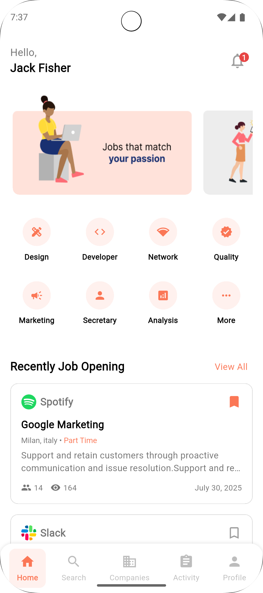
  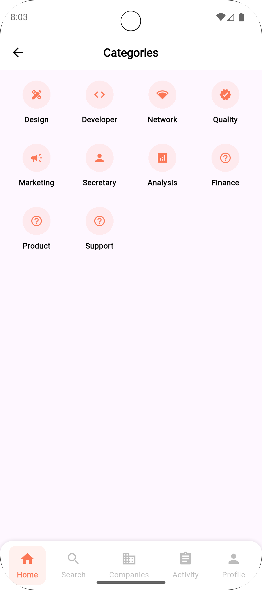
  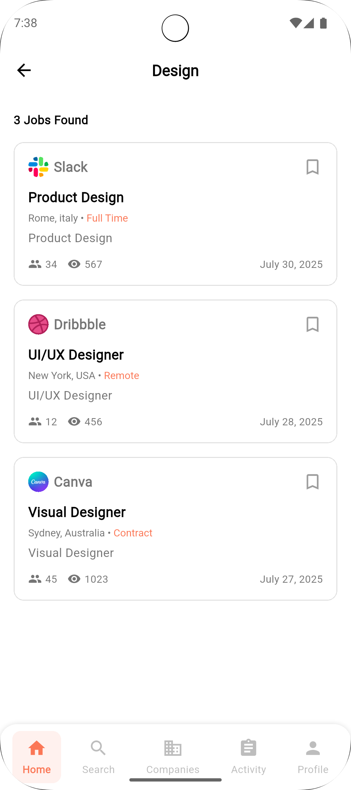
  
</p>

<p align="center">
  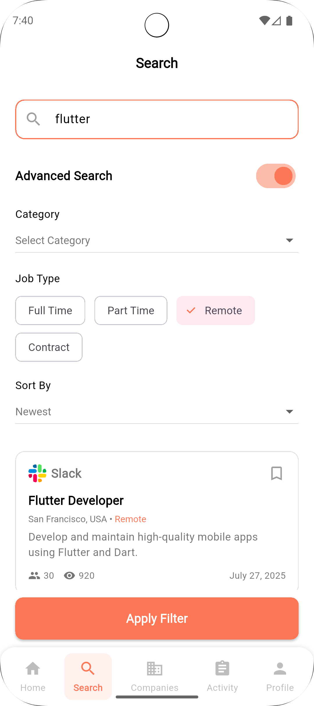
  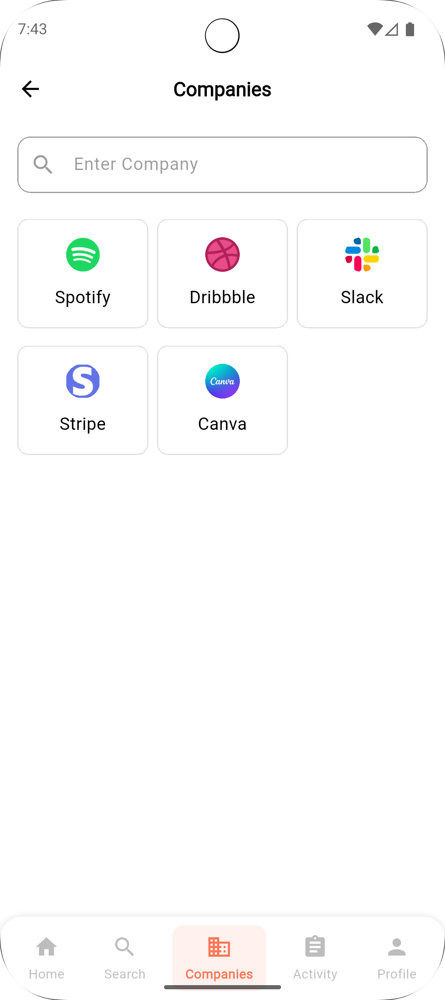
  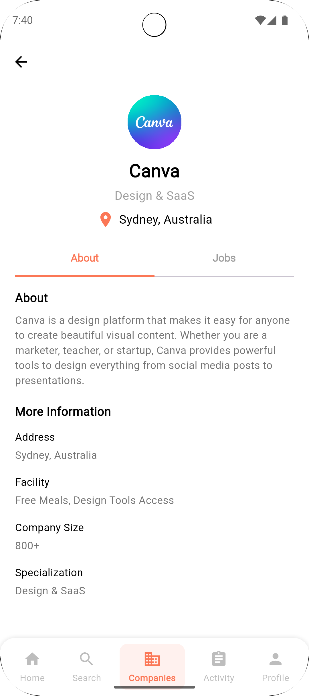
  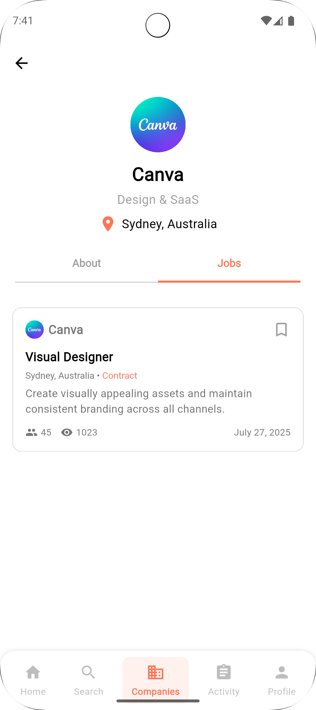
</p>

<p align="center">
  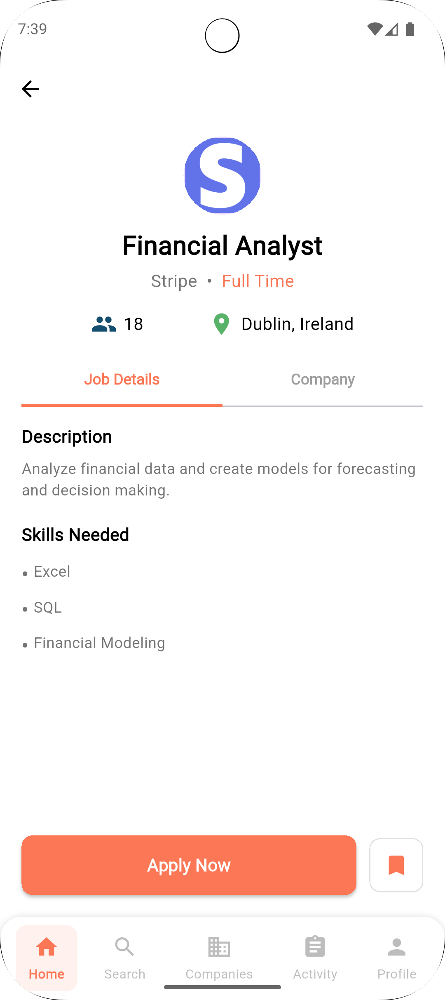
  
  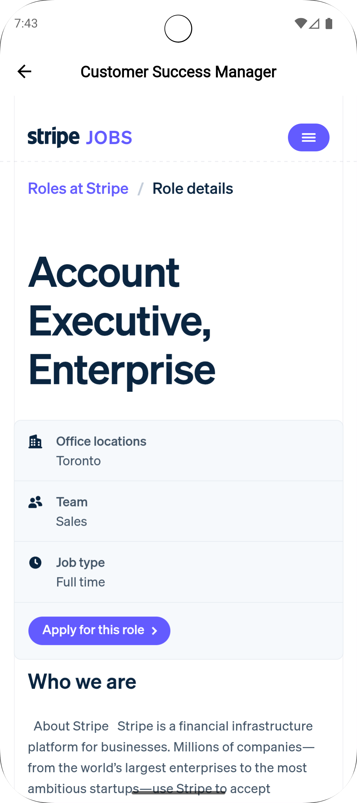
  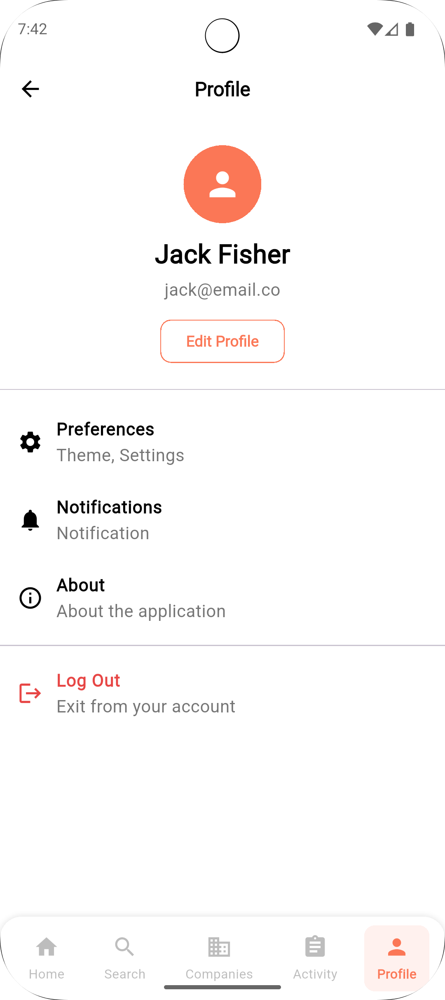
</p>

---

### 🌚 Dark Design

<p align="center">
  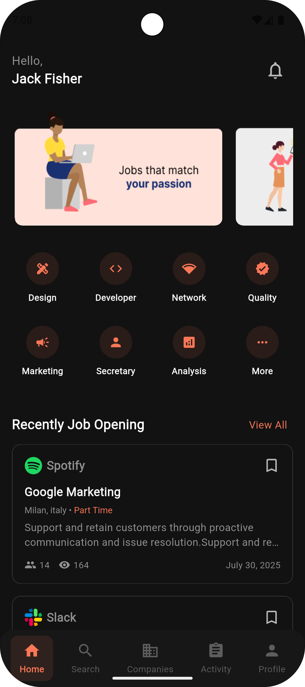
  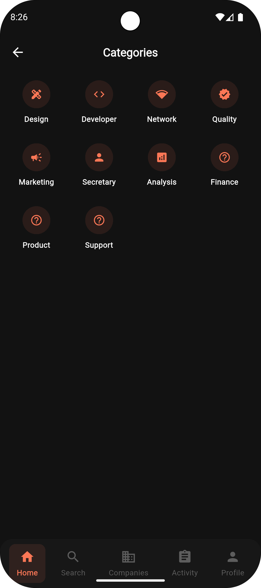
  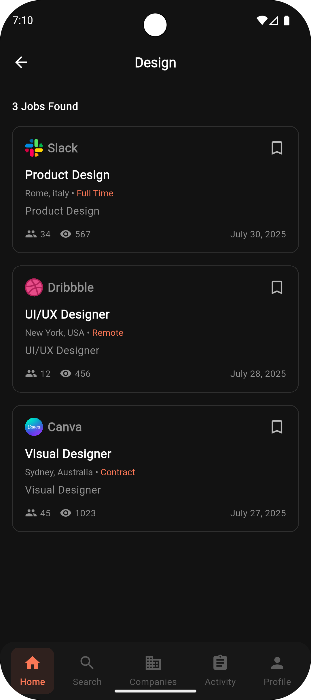
  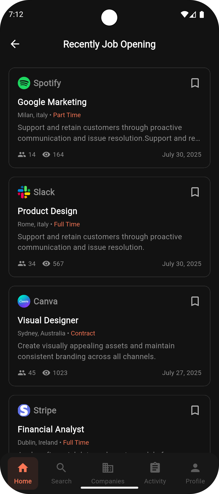
</p>

<p align="center">
  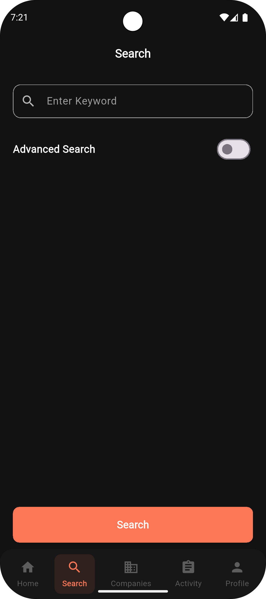
  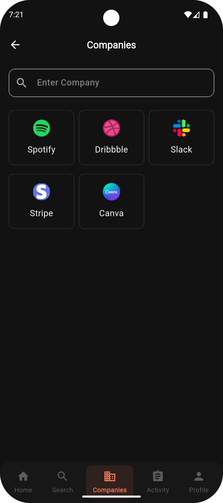
  
  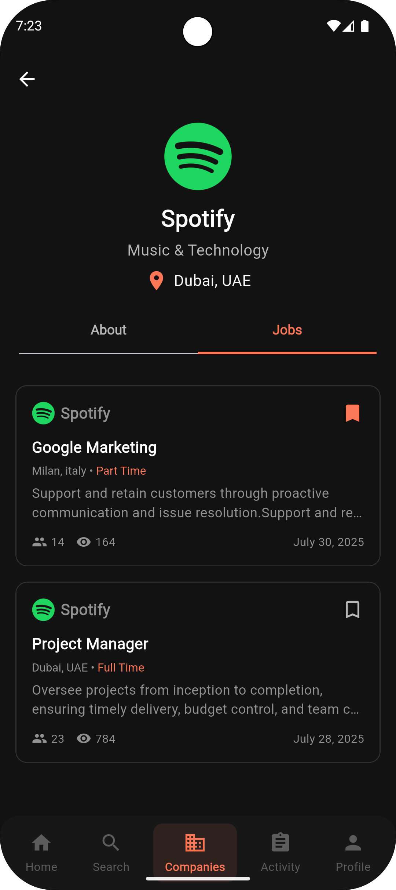
</p>

<p align="center">
  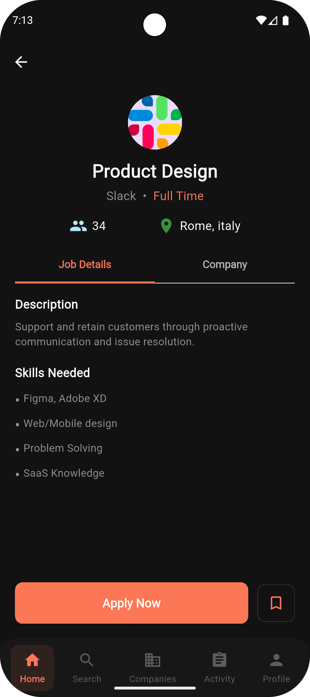
  
  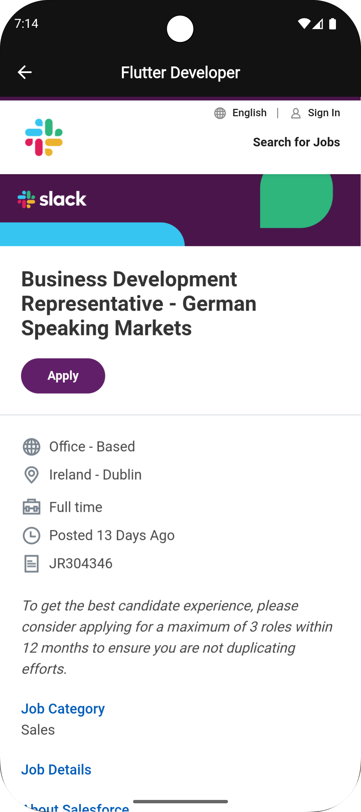
  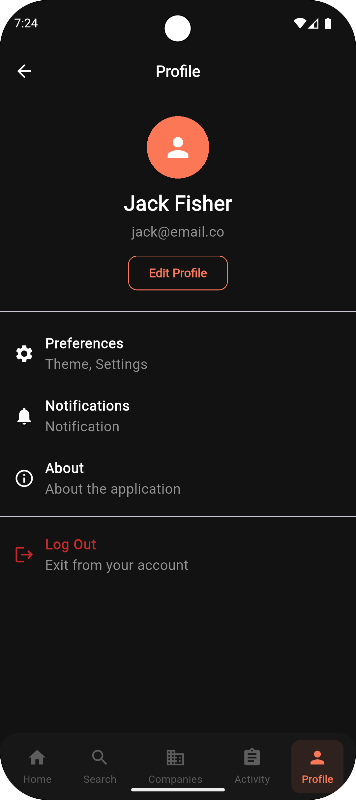
</p>
  
---

## ⚙️ How to Run

1. **Clone the repo**  
   ```bash
   git clone https://github.com/golnooshA/job-tracker.git
   cd job-tracker

2. **Install dependencies**

   ```bash
   flutter pub get
   ```

3. **Run the app**

   ```bash
   flutter run
   ```


